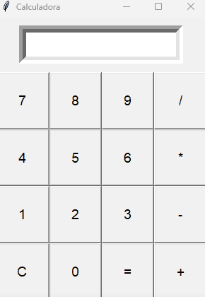

# Calculadora-muy-simple
calculadora demasiado simple en Python.

Posee funciones básicas de aritmética como sumar, restar, dividir y restar.
Proyecto simple escolar.

No hay mucho mas que agregar.
